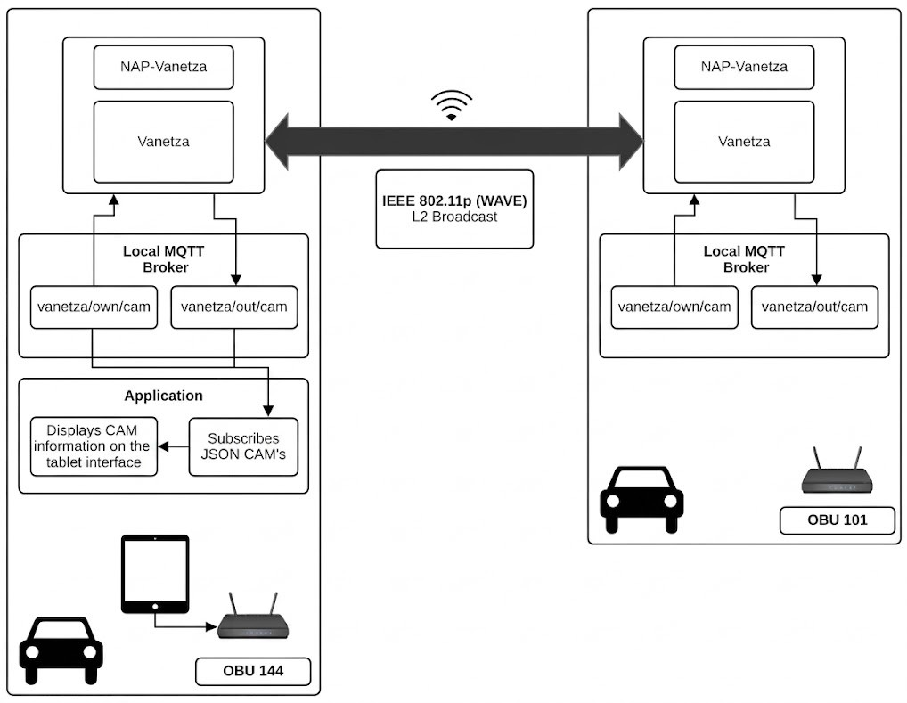
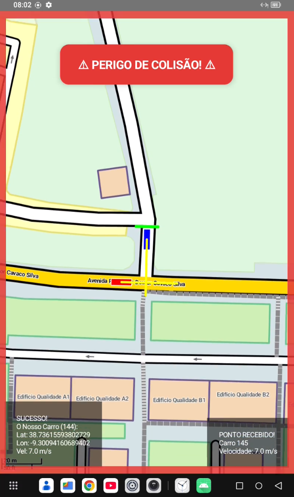
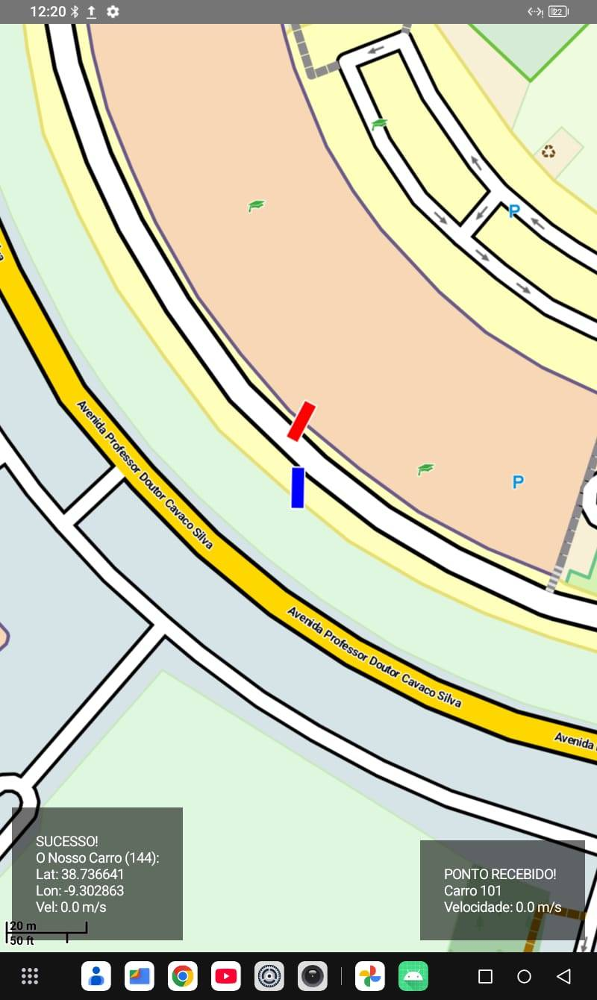

# 🚗 ADAS Map App

Lightweight **Advanced Driver Assistance System (ADAS)** mobile application developed in **Kotlin** for Android.
This app visualizes real-time vehicular data using **Cooperative Awareness Messages (CAMs)** over a VANET environment and displays it on an offline vector map powered by Mapsforge and OpenStreetMap data.

Developed as part of the **Integrated Project** course in the **BSc in Telecommunications and Informatics Engineering** at Instituto Superior Técnico.


📄 **[Read the full project report](docs/PIC-1-Report.pdf)**

---
## 📌 Overview

This project was developed as part of the final project (PIC) for the **Licenciatura em Engenharia de Telecomunicações e Informática (LETI)** at Instituto Superior Técnico (IST).

The goal is to implement a **lightweight ADAS system** that leverages **vehicular communication (VANETs)** to improve road awareness and assist drivers through real-time information.

The mobile app acts as the **visual and interactive layer** of the system. It receives telemetry forwarded by the host APU, reconstructs the surrounding vehicles geographically, and evaluates short-term collision and overtaking situations locally on the Android device.

---

## 🧠 System Architecture

The current system is centered around vehicular communication (V2V), where the Android device acts purely as a visualization interface connected to a host OBU:


---

### Components

* **OBU (On-Board Unit)**
  Installed in vehicles, responsible for generating and broadcasting CAM messages.
  Forwarding relevant data to the connected device


* **RSU (Road-Side Unit)**
  Infrastructure nodes that relay or broadcast vehicular data.

* **Android App (this repository)**
  Receives CAM data and provides:

  * Real-time visualization
  * Collision and overtaking warnings
  * Offline map-based interaction

  
  In the tested deployment, the Android tablet is connected by Ethernet to the host APU (station 144). A second APU represents a neighboring vehicle. The RSU shown in the conceptual diagram is part of the broader C-ITS architecture and is not required by the tablet application itself.
---

## 📡 Cooperative Awareness Messages (CAM)

CAMs are standardized messages defined in ETSI C-ITS used to share real-time information between ITS stations.

### Data includes:

* Vehicle ID
* GPS position (latitude, longitude)
* Speed
* Heading
* Vehicle length and width
* Timestamp / update age

### 📦 Example (simplified)

```json
{
  "stationID": 12345,
  "latitude": 38.7376,
  "longitude": -9.3031,
  "speed": 13.5,
  "heading": 270
}
```
---

## 📱 Mobile Application

### ✨ Features

* 🗺️ Real-time vehicle visualization on map
* 🚗 Vehicle polygons scaled and rotated using CAM dimensions and heading
* ⚠️ Predictive collision warnings based on trajectory and polygon intersections
* ↔️ Blind-spot overtaking warnings using a rear transverse detection line
* 🔊 Visual, audio, haptic, and animated-border alerts
* 🔄 Live updates from vehicular network
* 📍 GPS-based positioning



### 🗺️ Map Integration

The app uses **Mapsforge** to render locally packaged OpenStreetMap vector data:

* Fully offline map rendering during operation
* Vector-based `.map` data optimized for Android
* Suitable for embedded and research applications



---

## ⚙️ Setup & Installation

### 📋 Requirements

* Android Studio
* Android device or emulator
* Network access to the CAM source or a telemetry mock
* A Mapsforge `.map` asset for the intended operating area

### 🚀 Steps

1. Clone the repository:

   ```bash
   git clone https://github.com/KyNixx/AdasMapApp.git
   ```

2. Open in Android Studio

3. Build and run on a device

The app listens for UDP packets on port `5000`. The provided build is intended for Android devices connected to the host APU, although mocked JSON telemetry can also be used for laboratory tests.

---

## 🔌 Integration with VANET System

The app expects to receive CAM data via a network interface.

### 📡 Communication 

* Protocol: UDP
* Port: `5000`
* Format: JSON

### Data Flow

1. **Vanetza / NAP-Vanetza** obtains CAM data from the C-ITS network and exposes it through MQTT topics

2. Python subscriber services forward own and neighboring CAM JSON messages from MQTT to the tablet using UDP

3. The tablet is directly connected to the host OBU via Ethernet, receiving both message types on UDP port `5000`:

   * 🟢 Own CAMs (from the host vehicle)
   * 🔵 Out CAMs (from surrounding vehicles)

   The app then parses this data and maintains a local representation of:

   * The host vehicle
   * Nearby vehicles

4. The Android app parses the JSON messages and renders the host vehicle and nearby vehicles in real time.

5. The app evaluates predicted trajectory intersections for collision warnings and checks the rear detection line plus heading similarity for overtaking warnings.


## Hardware Context (High-Level)

This project is designed to operate with real vehicular communication hardware:

* OBUs (On-Board Units)
* RSUs (Road-Side Units)
* ETSI C-ITS protocol stack
* Deployment and testing at the **IST Taguspark testbed**

The app itself is hardware-agnostic and only depends on receiving properly formatted CAM data.

---

## 🧪 Validation

The report documents three validation approaches:

* CAM reception tests using UDP monitoring on the Android device
* Mocked collision, overtaking, and opposite-direction scenarios
* On-the-field tests with two vehicles and the supervising professor

The mocked telemetry script is included in the report appendix as `mockCollisionTest.py`. The report also includes links to recordings of the mocked and on-the-field scenarios.

---

## 🤝 Contributing

This repository is part of an academic project, but suggestions and improvements are welcome.

---

## 📄 License

This project is licensed under the terms of the MIT License.

See the `LICENSE` file for more details.

---

## 🗺️ OpenStreetMap Attribution

This project uses data from OpenStreetMap.

© OpenStreetMap contributors

The map data is available under the Open Database License (ODbL):
https://opendatacommons.org/licenses/odbl/1-0/

You are free to use the data, provided that you give appropriate credit to OpenStreetMap and its contributors, and you share any derived database under the same license.

---

## 🧑‍💻 Authors

* Francisco Cardoso
* [Diogo Folião](https://github.com/dsquid2002)

---

## ⭐ Acknowledgments

* Instituto Superior Técnico (IST)
* VANET / C-ITS research community
* OpenStreetMap contributors

---
